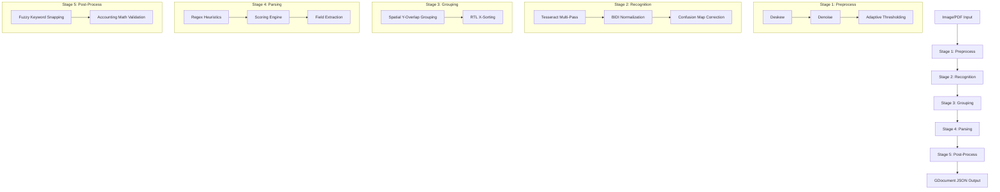

# Receipt OCR & Parsing for Hebrew

A powerful, native end-to-end OCR and parsing pipeline built for Hebrew receipts, outputting data fields into an ABBYY GDocument JSON structure format.

---

## 🏗 System Architecture & Flow

The pipeline follows a sequential, 5-stage architecture designed to handle the complexities of Hebrew (RTL) text and varied receipt layouts.



---

## 🧬 Step-by-Step Pipeline Logic

### Stage 1: Preprocess (`stages/preprocess/`)
This stage cleans and prepares the image to maximize OCR readability.
- **`Deskew`**: Detects the rotation of the receipt (e.g., if the photo was taken at an angle) and straightens it. This ensures text lines are horizontal for the grouping stage.
- **`Denoise`**: Applies a Gaussian Blur to remove "salt and pepper" noise from the image, preventing Tesseract from misidentifying speckles as punctuation.
- **`Adaptive Thresholding`**: Converts the image to strictly Black & White. Unlike simple thresholding, "Adaptive" thresholding calculates local B/W values, which handles shadows and uneven lighting common in receipt photos.

### Stage 2: Recognition (`stages/recognition/`)
This stage converts pixels into raw text and corrects obvious character slips.
- **`Tesseract Multi-Pass`**: Runs OCR multiple times with different Page Segmentation Modes (PSM). PSM 3 is used for standard pages, while PSM 6 is used for sparse, uniform blocks. This catches text that a single pass might miss.
- **`BIDI Normalization`**: Hebrew is Bi-Directional (RTL). This step ensures that mixed Hebrew/English strings (like "100 NIS") are stored in a logical, parsable sequence.
- **`Confusion Map Correction`**: Uses `confusion_map.json` to fix common OCR character errors. For example, if Tesseract misreads the Hebrew letter "ם" as a square symbol, the map snaps it back based on frequency data.

### Stage 3: Grouping (`stages/grouping/`)
This stage assembles individual "word" boxes into coherent logical lines.
- **`Spatial Y-Overlap Grouping`**: Words aren't always on the same pixel row. This algorithm groups words into a single line if their vertical "footprints" overlap significantly.
- **`RTL X-Sorting`**: Since Hebrew is RTL, the rightmost word in a line is actually the *first* word. This step sorts words from right-to-left so that sentences are reconstructed in the correct grammatical order.

### Stage 4: Parsing (`stages/parsing/`)
This is the "Intelligence" layer that identifies what each number and word means.
- **`Regex Heuristics`**: Uses complex Regular Expressions to find dates, currency symbols, and invoice numbers. It is "Heuristic" because it searches for patterns (e.g., "DD/MM/YY").
- **`Scoring Engine`**: Assigns "points" to candidates. A date candidate gets +10 points if it's at the top of the page and +15 if it follows the keyword "תאריך" (Date). The candidate with the highest score wins.
- **`Field Extraction`**: Once the "anchors" (Total, Date, Vendor) are found, this step extracts the remaining text into Line Items (Description, Price, Quantity).

### Stage 5: Post-Process (`stages/post_process/`)
This stage performs a "Sanity Check" on the results before outputting them.
- **`Fuzzy Keyword Snapping`**: Uses fuzzy string matching to fix words that the OCR almost got right. It turns "סהכ" (S.H.K) into the clean keyword "סה\"כ" so the parser can find it.
- **`Accounting Math Validation`**: Enforces the "Ledger Rule": `Subtotal + VAT = Total`. If the numbers don't add up, it tries to auto-correct (e.g., by swapping Subtotal and Total if they were detected in the wrong order).

---

## 📂 Repository Structure

```text
Receipt OCR/
├── cli/                # Terminal entry point (main.py)
├── gui/                # Desktop application (PyQt/Tkinter based)
├── stages/
│   ├── preprocess/     # Image cleaning & deskewing logic
│   ├── recognition/    # Tesseract client & BIDI normalization
│   ├── grouping/       # Line assembly from word boxes
│   ├── parsing/        # Regex patterns, model definitions, & extractors
│   └── post_process/   # Fuzzy correction & Math validation
├── utils/              # Shared helpers (confidence, text normalization)
├── test_accuracy/      # Evaluation suite for benchmarking
├── config.yml          # Global configuration (Tesseract paths, thresholds)
└── confusion_map.json  # Hebrew-specific character error mappings
```

---

## 🚀 Getting Started

### 1. Tesseract Installation (Required)
The pipeline requires Tesseract OCR with Hebrew language data.
- **Windows**: Install from [UB-Mannheim](https://github.com/UB-Mannheim/tesseract/wiki).
- **Important**: Ensure `heb` and `eng` data files are in your `tessdata` folder.
- Update `config.yml` with the path to your `tesseract.exe`.

### 2. Installation
```bash
pip install -r requirements.txt
```

### 3. Running the Pipeline
- **GUI**: `python -m gui.app`
- **CLI**: `python -m cli.main --image "path/to/receipt.jpg"`
- **Tests**: `python -m test_accuracy.cli`

---

## 📊 Output Format (GDocument)
The pipeline exports results in a structured JSON format compatible with ABBYY GDocument:
- `merchant`: string
- `date`: ISO 8601 string
- `total`: float
- `items`: list of objects (description, quantity, unit_price, line_total)
- `invoice_no`: string
